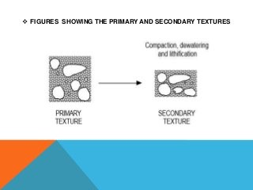
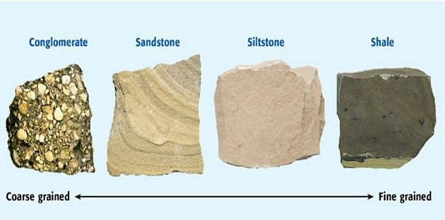
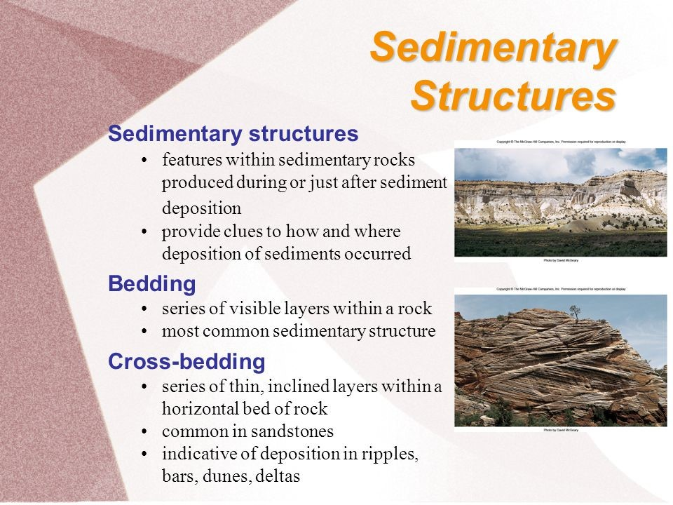
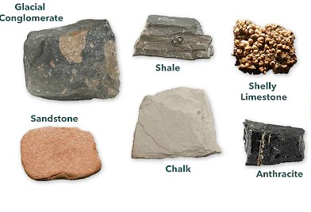
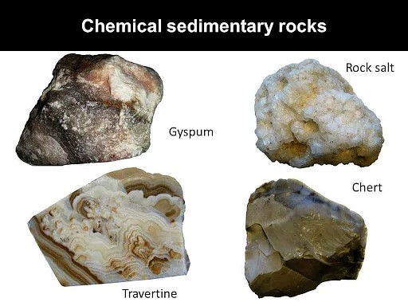
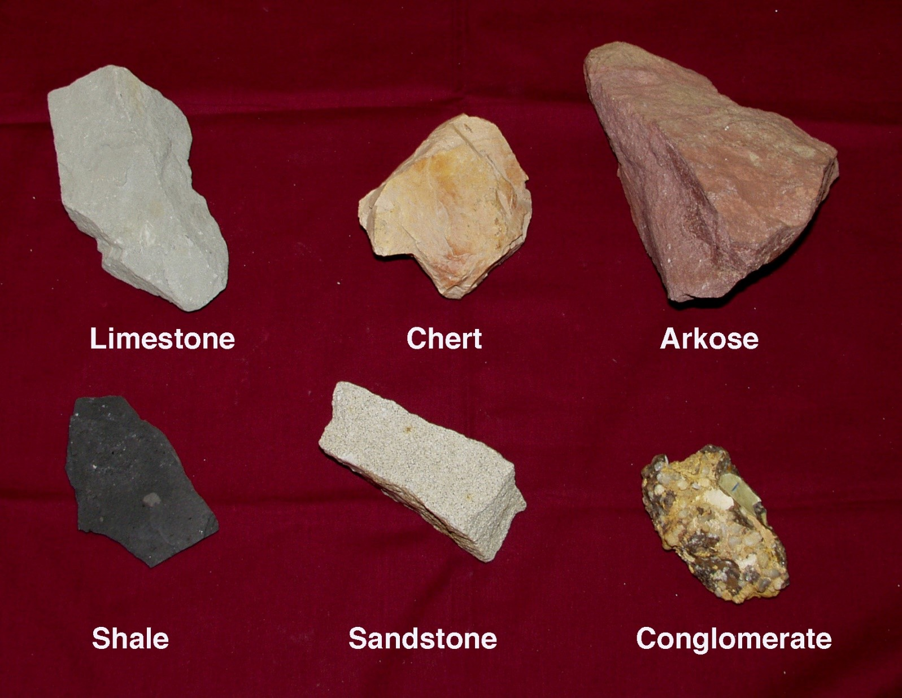
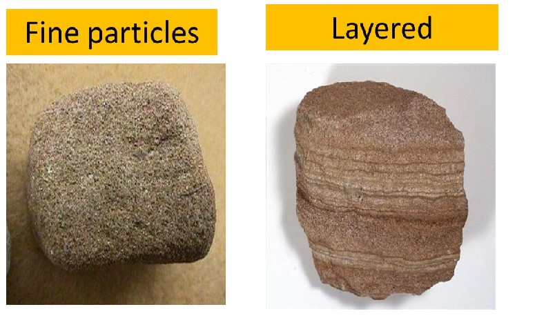
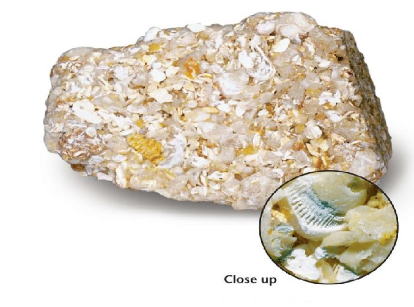

### INTRODUCTION
Sedimentary rocks are rocks formed by deposition from a fluid (i.e., water, air, or ice). They are classified on the basis of their texture, grain size, and mineralogical composition.
### Texture:
Texture refers to the size, shape and three-dimensional arrangement of the grains that make up sediments or sedimentary rock. Texture is a small-scale character of a rock, but assumes importance in many of its significant properties, such as bulk density, porosity and permeability. We can use texture of sedimentary rocks to infer the mode and distance of transport, energy condition and depositional processes.
Textures can be clastic, where they are composed of grains derived from pre-existing rocks or non-clastic, where sediments precipitate from a fluid. 
### Clastic texture:
Clastic textures are commonly described in terms of grain size of sediments, their sorting behaviour, degree of roundness, packing of grains, textural maturity and grains binding materials like matrix and cement. Texture of clastic sedimentary rocks is produced primarily by physical processes of sedimentation. It is characteristic feature of rocks such as conglomerates, sandstones and shales fragments which are derived from pre-existing rocks – igneous, metamorphic or even pre-existing sedimentary rocks. Some biochemical sedimentary rocks such as fossiliferous limestones (coquina) are composed of shell fragments also exhibit clastic texture. Clastic sedimentary rocks are composed of grains, fragments of pre-existing rocks that have been packed together with spaces (pores) between grains. These pores may later be filled in with cementing materials such as silica or calcite deposited by groundwater moving through the sediment. 
Examples of clastic sedimentary rocks are sandstone and conglomerate. Some clastic sedimentary rocks (such as shale and mudstone) are fine enough that the individual grains cannot be distinguished.
These fine-grained rocks are said to have an aphanitic texture.
 ### Non clastic (crystalline) texture:
 It is formed by chemical or biochemical precipitates from fluids. It may also be produced by recrystallisation or alteration of pre-existing rocks. Grains show an interlocking mosaic of crystals. Chemical sedimentary rocks such as limestone, dolomite, rock salt and gypsum show such texture.
 Sedimentary rocks may have clastic (detrital) or non-clastic texture. 
Non-clastic textures are found chiefly in rocks that have precipitated chemically from water (chemical sedimentary rocks), such as limestone, dolomite and chert. Other non-clastic sedimentary rocks include those formed by organisms (biochemical rocks), and those formed from organic material, such as coal. 
Rocks formed mainly from shell fragments are technically clastic rocks, but are commonly classed with the non-clastic ones because they too are chemical precipitates - except that organisms did the precipitating. If non-clastic rocks are fine-grained enough, they too can be called aphanitic.
Clastic sedimentary rocks are subdivided on the basis of grain size. Secondary characteristics used to further distinguish clastic rocks are sorting, grain shape, and grain composition. 

 Grain size:
Clastic sediments are distinguished on the basis of average grain size.
gravel-size particles are larger than 2 mm diameter
sand-size particles range in diameter from 1/16 to 2 mm (they feel like sandpaper)
silt-size particles have diameters from 1/256 to 1/16 mm (they feel finely gritty)
clay-size particles are smaller than 1/256 mm in diameter (they feel smooth)
Roundness and Sorting:
Roundness is an important characteristics of the texture of clastic sedimentary rocks. Roundness is indicates the extent to which the corners of individual grains have been rounded off. The roundness scale runs from angular through subangular to subrounded and well-rounded. All other things being equal, the rounder a grain is, the greater distance it has been transported, or the more it has been agitated against other grains.
Sorting is the extent to which the grains making up a clastic rock are all about the same size.
 A well-sorted sedimentary rock consists of grains which are all in the same size range (such as a sandstone that's mostly sand size grains with very little silt or clay mixed in.) 

A poorly-sorted sedimentary rock will contain a large range of sizes; in particular, poorly-sorted rocks will have a lot of silt and clay-size particles in among the coarser grains. 
Sorting reflects the extent to which the processes transporting or depositing the sediment have been able to separate the different sizes and carry away finer particles.
A sediment or sedimentary rock is said to be well-sorted if all clasts are of similar size and poorly-sorted if it contains a wide variety of different sized grains, especially if it contains fines in among coarser grains.

|Name of Particle |Size Range |Loose Sediment |Consolidated Rock |
|---|---|--|--|
|Boulder|>256mm | Gravel |Conglomerate or Breccia(depends on rounding) |
|Cobble|64-256mm | Gravel |Conglomerate or Breccia(depends on rounding) |
|Pebble|2<64mm | Gravel |Conglomerate or Breccia(depends on rounding) |
|Sand|1/16-2mm | Sand |Sandstone |
|Silt|1/256-1/16mm | Silt |Siltstone |
|Clay|1<256mm | Clay |Claystone,mudstone and shale |

 Textures are said to be primary, where the detrital grains possess their arrangement that existed after they came to rest in the basin of deposition or after precipitation (in the case of crystallines). Secondary textures are produced due to the alteration in the original arrangements of grains. Grains are rearranged due to the weight of overlying sediments causing compaction during lithification.

### Textures are controlled by the following factors: 
-  The nature and type of the source rocks or provenance. It can be igneous, sedimentary, and metamorphic;
- Texture and composition of pre-existing or source rock; 
- Mode of weathering which can be physical, chemical and biological; 
- Mode, energy and nature of medium and distance of transportation; 
- Depositional processes; 
- Diagenesis of sediments; and • Tectonics of depositional sites.

### Mineralogy: 
The most common materials in sedimentary rocks: less common sedimentary minerals quartz gypsum feldspar halite clay hematite calcite limonite dolomite rock fragments Small amounts of amphibole, pyroxene, and mica may also be found in some sedimentary rocks
coarsegrained 

|The most Common materials in sedimentary rocks|less common sedimentary minerals|
|--|--|
| quartz|gypsum|
| feldspar|halite|
| clay|hematite |
| calcite|limonite|
|dolomite| |
|rock fragments| |

 
Small amounts of amphibole, pyroxene, and mica may also be found in some sedimentary rocks.

### Classification of sedimentary rocks:
A very workable classification of sedimentary rocks is given in the accompanying handout. Brief descriptions of some of the important sedimentary rocks are given below.
Conglomerate is made of rounded gravel particles in a sand or finer-grained matrix; breccia is simply a conglomerate composed of angular, rather than rounded, particles.
Sandstone is composed dominantly of sand-size particles. Well-sorted sandstones contain little or no silt and clay;poorly-sorted sandstones have considerable silt and clay in the spaces between the sand grains.
 Greywacke sandstone is a medium to dark grey, fairly dense, poorly-sorted sandstone typical of submarine trenches.
Siltstone is composed chiefly of silt-size particles (usually quartz). Broken surfaces feel gritty. If you can scrape off some of it and wet it, it will feel finely gritty between your fingers or in your mouth.
Shale consists of finely laminated (thinly layered) clay-sized particles. If this fine-grained material lacks layers, it is called mudstone or claystone. These rocks are smooth to the touch. Shales and mudstones commonly contain siltsize particles as well as clay.
Limestones consist almost entirely of calcite. Chalk consists of minute (microscopic or sub-microscopic) silt-size
shells; it has a gritty feel. Coquina is made up almost entirely of large shell fragments. Some limestones are very fine-grained (aphanitic) and are formed of limy mud.
Chert is a hard, aphanitic, non-clastic rock composed entirely of microcrystalline quartz. Diatomite is a very fine, light-weight chalky white rock formed from the silica shells of diatoms (microscopic one-celled plants). Diatomite has a smooth, powdery feel.
Coal is formed from heating and compression of peat––vegetative material that accumulates in bogs and swamps.
(Strictly speaking, coal is metamorphosed peat; but it is usually grouped with sedimentary rocks.)

### Structure of Sedimentary Rocks

Any variety of large-scale features are produced in sedimentary rocks by sedimentary processes are called the sedimentary structure. The principal types of sedimentary structures are as follows:
- Primary Sedimentary structure: Formed at time of deposition. E.g. Bedding.
- Secondary sedimentary structure: Formed after the time of deposition. E.g. Nodules
- Organic sedimentary structure: Developed due to action of organisms. E.g. Stromatolite, Track & Trails etc.

### Images of Non clastic (crystalline) texture:

