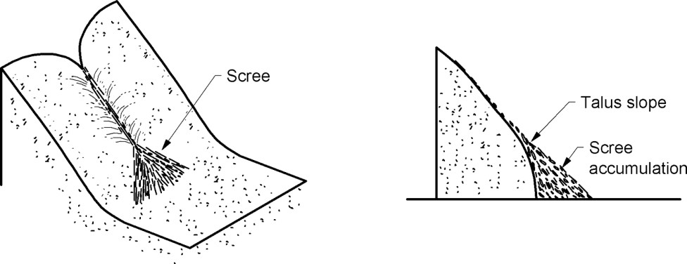
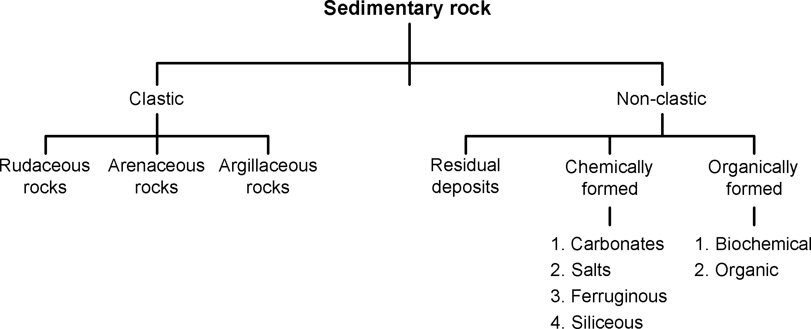
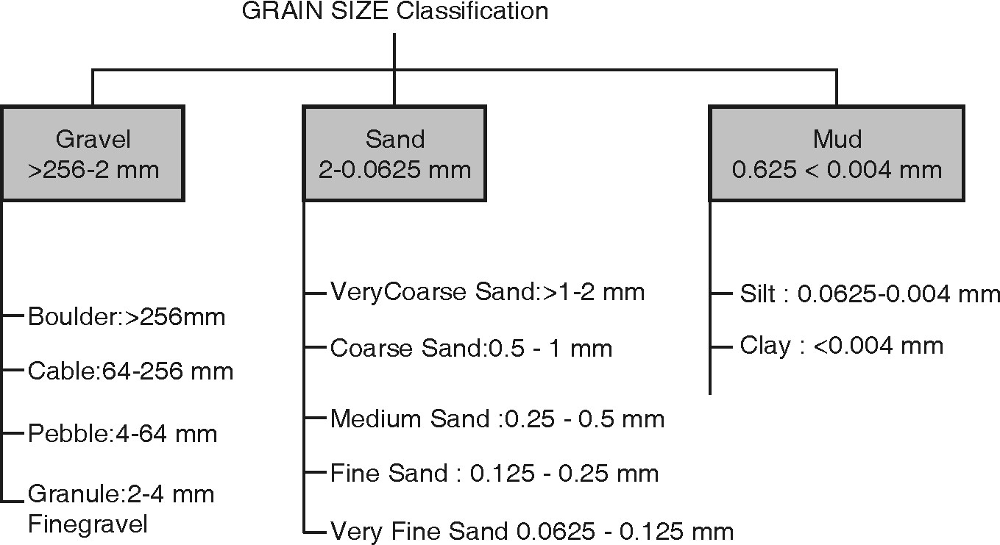

# INTRODUCTION
- The rocks formed from sediments are called as ‘Sedimentary rocks’.
- The total amount of sedimentary rocks that exist in upper 16 km of earth’s crust is estimated to be only about 5%.
- These rocks are found chiefly as an extensive cover over continents.
- In sedimentary petrology, study of sedimentary / secondary rocks with reference to mineral and chemical composition, 

megascopic and microscopic properties, genesis is carried out.
The rocks formed by the deposition of products of rocks weathering i.e. sediments are called as sedimentary rocks. Sedimentary rocks include rocks formed by accumulation of chemically precipitated or organically derived materials. Sedimentary rocks occur in layer and frequently contain fossils.
### Rock Weathering :
- Weathering is defined as the total effect of various subaerial processes that bring about decay and disintegration of rocks exposed on the surface of the earth. Weathering is related to the surface of the lithosphere where rocks, air and water come together. 
- Denudation is the wearing down of rocks of the earth’s crust. This is accomplished in three stages. In the first stage the long and continuous exposure of rocks to weather elements (temperature, pressure and moisture) lead to their disintegration and decomposition. 
- In the second stage, the products of disintegration and decomposition are removed by agents of transportation such as flowing rivers, wind, gravity, solution and moving ice. 
- The third stage involves the deposition of the transported weathered products in a depression or basin, which later form sedimentary rocks.

##### The geological work accomplished by weathering is of two types.
- Physical Weathering.
- Chemical Weathering.
- Physical Weathering :
        Physical or mechanical weathering which leads the rock to disintegrate by the action of temperatures changes,  frost action, and work of organisms.
- Disintegration :
	It is the mechanical breaking up of rocks. It aids decomposition which is the chemical alteration of rock materials. Sometimes the chemical changes become entirely responsible for the mechanical break down of the rocks.

The following factors contribute to disintegration:
- **Frost action** -  Extreme diurnal or seasonal changes leads to alternate heating and cooling in exposed rocks. This leads to development of cracks  resulting from continuous expansion and contraction through length of time. The water on entering these cracks, crevices, joints, bedding planes  and fissures, freeze and thaw alternately. At high altitudes the temperature rises above 55 degrees Celsius and falls below freezing point at night. This leads to rock fracturing in areas without snow cover. The fractured angular blocks get dislodged and move downslope and accumulate at lower levels forming Scree.  They are not permanent as they are removed by landslides, glacier transport and avalanches.

- **Temperature changes**  - In regions where extreme climates prevail, such as in dry  deserts of arid and semi arid  climatic regions, the high heat during the day heats the rocks to very high temperatures and at nights they are cooled to very low temperatures. Only the outer layers of the rocks are affected because rocks are poor conductors of heat. 	Thus the outer thin layers peel off as curved shells during weathering. Exfoliation is the phenomenon   in which  the outer layers of the rock separate into thin curved layers leaving behind a rounded mass of rock or residual boulders. Weathering of this type is called spheroidal weathering and is normally seen to occur in massive granite rock bodies. The weathering is initiated from the corners, sides and edges of these rocks till they are worn out. 

- **Gravity**  The downward slow movement of the weathered products from  mountain slopes with slope angles greater than 45 &deg; or the fall of  fragments from steep mountain valleys and cliffs is due to the action of  gravity. These fragments on accumulation at the mountain base are called  Talus ( refer Fig. below). The Talus is identified on the field by measuring the angle between the accumulation at rest and the horizontal. The angle varies between 25 to 30 &deg;

 

- **Work of plants and animals** -
    Burrowing animals, worms and growing rootlets of plants enlarge the cracks and crevices which loosen the material, for removal by geological agents of weathering. Fungi and lichen  aid in chemical weathering as they extract material from the rock on which they form. Bacteria present in water acts on rock mineral matter and soils. The decomposition of dead organisms and plants is accelerated by the microbial activity of micro organisms present in the soil leading to the formation of Humus. The humus complex releases humic acid in the soil and enhances the decomposition of the decayed animal and vegetal matter.
- **Chemical Weathering** -
Chemical changes in which the minerals are decomposed, dissolved and loosened by water, oxygen, carbon di oxide of the atmosphere and decaying organisms.
- **Decomposition** -
It is the breaking down of the mineral into soluble compounds and removed in solution. This weakens the rocks and makes it susceptible to the action  of other agents of weathering. Thus the rocks are disintegrated because of  the removal of the adhesion between minerals. The soluble compounds on  removal leave the rocks porous disintegrating it rapidly. Alteration  products occupy a greater volume than the original matter. 
The following factors contribute to decomposition :
  - **Solution :** This is well observed in limestone terrain, where they are readily attacked and the carbonate is converted to bicarbonate. This is readily soluble in and carried away in solution. Impurities in the limestone rocks that remain undissolved are left behind in the soil. 
		**CaCO~3~+H~2~O+CO~2~ = Ca(HCO~3~)~2~**
	When the rainwater with dissolved carbon di oxide  enters the cracks and crevices of non carbonate rocks attacks them and dissolves the carbonates leaving behind others minerals which accumulate to form components of soil.	
   - **Oxidation :** It is the dissolved oxygen in water that acts as agents of chemical weathering. Soil colour in tropical regions are yellow, red and brown. This is because the iron minerals and their silicates (olivines, pyroxenes and amphiboles) in the rocks are attacked converting ferrous ion to ferric ion eg Hematite. The ferrous ion when converted to its hydroxides such as limonite and Goethite show a range of colours varying from greenish black to yellow and brown.
    - **Hydration:** Hydrous oxides and hydrous silicates result from the addition of water during chemical weathering. Alkali and Plagioclase  feldspars release the excess potassium and silica at the same time and the aluminium is converted to kaolin (constituent mineral in clay). Zeolite, Talc Chlorite and serpentine are examples of hydrous silicates
	**2KAlSi~3~O~8~+2H~2~O+CO~2~ = Al~2~SiO~5~(OH)~4~+4SiO~2~K~2~CO~3~**
  - **Carbonation:** Surface waters contain dissolved carbon di-oxide from the atmosphere. The carbonated water becomes an active agent of in the process of decomposition. The carbonated water reacts readily with rocks containing oxides of metals such as calcium, magnesium, sodium and potassium to  form their  carbonates and  bicarbonates. From solutions containing
  **Fe(HCO~3~)~2~** ,Limonite is precipitated. Reaction of potash feldspar with carbonic acid is shown below.
	**2KAlSi~3~O~8~+2H~2~CO~3~+H~2~O=Al~2~Si~2~O~5~(OH)~4~+2KHCO~3~+4SiO~2~**
Classification of Sedimentary Rock :	The sediments, from which sedimentary rocks are formed, may be divided into two major groups.

#### Classification of Sedimentary Rock :	The sediments, from which sedimentary rocks are formed, may be divided into two major groups.

 
**Clastic Sediments :**
- Clastic sediments are broken fragments of preexisting rocks ranging in size from minute clay particles to very large boulders.
- Clastic rocks are formed by mechanical accumulation of grains of clastic sediments.
- Depending upon size of constituent grains, the clastic rocks are classified as:
    - Rudaceous rocks
    - Arenaceous rocks
    - Argillaceous rocks
    
-	**Rudaceous rocks :**
•	These rocks are formed by accumulation of bigger rock fragments such as gravels, pebbles and boulders. If grains are rounded, rock is called as “Conglomerate”. If they are angular then these rocks are called as ‘Breccia’. 
-	**Arenaceous rocks :**
•	These rocks are composed almost entirely of sand grains. When individual grains are rounded then the rock is called as “Sandstone” and “Grit” if the grains are angular.
-	**Argillaceous rocks :**
•	These rocks are made up of very fine-grained sediments. “Shale” and “mudstone” are typical argillaceous rocks, which are composed of clay-sized sediments.

#### 1.6.2.2	Non-Clastic Sediments :	Non-clastic rocks include those sedimentary rocks, which are formed by chemical precipitation of minerals from water or by accumulation of remains of animals and plants.
They are classified into two groups:
- Residual deposits
- Chemically formed rocks
- Organically formed rocks

**(a)	Residual Sedimentary Deposits :** 
-   Formation of laterite :
    - Laterite formations occurs only under tropical climates. The typical climate is characterized by strongly alternating dry and wet conditions. 
    - Under normal conditions of weathering i.e. in humid and temperate climate, silicates decompose; under strongly oxidizing tropical weathering, iron is ultimately converted into insoluble ferric oxides and ferric hydrates which are not transported but precipitated. 
    - Thus, under a tropical climate, weathering leads to laterite formation which is mainly composed of hydroxide of aluminium and hydrated ferric oxide.
- Formation of Bauxite :
		Like laterite, bauxite is formed under tropical weathering, from different rocks. Such weathering results in leaching of all soluble matter, leaving behind enriched residues of oxides and hydroxides of aluminium, ferric iron, manganese, titanium and free silica. Alumina rich i.e. feldspar rich rocks are more suitable for bauxite formation.
**(b)	Chemically formed rocks :**
    - These rocks are formed when minerals matter in solution is precipitated from water, usually because of changes in water temperature or chemical content of water.
On basis of composition, chemically formed rocks are classified as follows:
	**(i)	Carbonate Rocks :**
	Limestone’s and Dolomites are most abundant carbonate rocks. They are formed by chemical precipitation of calcium carbonate from seawater.
	**(ii)	Salt Rocks :**
	Evaporation is major process involved in deposition of chemical precipitates. The salt deposits formed by evaporation of saline lakes are called ‘evaporites’.
	The principal minerals of these deposits are chlorides and sulphates of Na, K, Mg and Ca.They commonly form massive beds.
    **(iii)	Ferruginous Rocks :**
	The rocks, which are formed by chemical precipitation of iron oxides.
Iron-stone is an e.g. of ferruginous Rocks.
	**(iv)	Siliceous Deposits :**
	Siliceous rocks are formed when silica is precipitated from water.
        e.g. Flint, Chert, Jasper and Agate.

    **( c)Organically formed Sedimentary rocks :**
These rocks are composed mainly of remains of animals or plants.Organically formed rocks are subdivided into two groups:

    These rocks are composed mainly of remains of animals or plants.
Organically formed rocks are subdivided into two groups:
    - (i)	Biochemical rocks.	
    - (ii)	Organic rocks.

	**(i)Biochemical Rocks :**
	The biochemical sediment is produced when plants and animals living under water, extract from it dissolved mineral matter usually calcite to form shells or other hard parts. These shells accumulate on ocean floor in great quantities to form sedimentary rocks. e.g. Shale, Limestone.
	**(ii)Organic Rocks :**
	Rocks containing organic matter belong to this group. e.g. Coal.

**Grain Size Classification :**
The sedimentary rocks can also be classified on the basis of the size of the sediments of which the rock is formed of. Mainly the sediments are classified as shown below-

